# Reconciliation: docu/adr/0028-github-desktop-version-control-parity.md

Generated from the current documentation graph.

## Affected documents

- [ ] Review and synchronize [README.md](../../../README.md)
- [ ] Review and synchronize [docu/README.md](../../README.md)
- [ ] Review and synchronize [docu/specs/SPEC-NEXUS.md](../../specs/SPEC-NEXUS.md)
- [ ] Review and synchronize [docu/specs/SPEC-agent-runtime.md](../../specs/SPEC-agent-runtime.md)
- [ ] Review and synchronize [docu/specs/SPEC-desktop-shell.md](../../specs/SPEC-desktop-shell.md)
- [ ] Review and synchronize [docu/spikes/001-opencode-runtime.md](../../spikes/001-opencode-runtime.md)
- [ ] Review and synchronize [docu/spikes/002-independent-review.md](../../spikes/002-independent-review.md)
- [ ] Review and synchronize [docu/spikes/003-desktop-framework.md](../../spikes/003-desktop-framework.md)
- [ ] Review and synchronize [tasks/todo.md](../../../tasks/todo.md)

## Broken references

- None.

## Mermaid UML

```mermaid
classDiagram
  class nDESIGNmd {
    <<document>>
  }
  class nPRODUCTmd {
    <<document>>
  }
  class nREADMEmd {
    <<document>>
  }
  class ndesktopREADMEmd {
    <<document>>
  }
  class ndesktopTHIRDPARTYLICENSESmd {
    <<document>>
  }
  class ndocuREADMEmd {
    <<document>>
  }
  class ndocuadr0001documentationfirstmd {
    <<document>>
  }
  class ndocuadr0002projectrepositoryidentitymd {
    <<document>>
  }
  class ndocuadr0003adaptiveworkflowmd {
    <<document>>
  }
  class ndocuadr0004runtimeportandopencodehttpmd {
    <<document>>
  }
  class ndocuadr0005governeddocumentcontextmd {
    <<document>>
  }
  class ndocuadr0006localprocesssupervisionmd {
    <<document>>
  }
  class ndocuadr0007gatedchangereviewmd {
    <<document>>
  }
  class ndocuadr0008thindesktopshellmd {
    <<document>>
  }
  class ndocuadr0009tauridesktopshellmd {
    <<document>>
  }
  class ndocuadr0010v03workspaceandproviderboundariesmd {
    <<document>>
  }
  class ndocuadr0011portablesidecarandautomaticreconciliationmd {
    <<document>>
  }
  class ndocuadr0012resumablesessionsandperrunpermissionsmd {
    <<document>>
  }
  class ndocuadr0013workspacerootauthorizationmd {
    <<document>>
  }
  class ndocuadr0014internalfileviewermd {
    <<document>>
  }
  class ndocuadr0015terminaltabsmd {
    <<document>>
  }
  class ndocuadr0016gitcontextswitchermd {
    <<document>>
  }
  class ndocuadr0017projectsandeditornavigationmd {
    <<document>>
  }
  class ndocuadr0018activeprojectcontextstatemd {
    <<document>>
  }
  class ndocuadr0019projectsminimalmanagementmd {
    <<document>>
  }
  class ndocuadr0020versioncontrolsurfacemd {
    <<document>>
  }
  class ndocuadr0021ptyinteractiveinputforwardingmd {
    <<document>>
  }
  class ndocuadr0022versioncontrolcommitflowmd {
    <<document>>
  }
  class ndocuadr0023codeeditorandformattingmd {
    <<document>>
  }
  class ndocuadr0024agentsurfacemd {
    <<document>>
  }
  class ndocuadr0025crosscuttingruntimeandgitworkspacemd {
    <<document>>
  }
  class ndocuadr0026claudecodecliadaptermd {
    <<document>>
  }
  class ndocuadr0027providerscopedmodelselectionmd {
    <<document>>
  }
  class ndocuadr0028githubdesktopversioncontrolparitymd {
    <<document>>
  }
  class ndocuknowledgeREADMEmd {
    <<document>>
  }
  class ndocuknowledgegithubdesktopauditmd {
    <<document>>
  }
  class ndocuknowledgeuiredesignlabmd {
    <<document>>
  }
  class ndocureleasesv03closemd {
    <<document>>
  }
  class ndocuspecsSPECNEXUSmd {
    <<document>>
  }
  class ndocuspecsSPECagentprovidersmd {
    <<document>>
  }
  class ndocuspecsSPECagentruntimemd {
    <<document>>
  }
  class ndocuspecsSPECchangesreviewgovernancemd {
    <<document>>
  }
  class ndocuspecsSPECdesktopshellmd {
    <<document>>
  }
  class ndocuspecsSPECdevelopmentworkflowmd {
    <<document>>
  }
  class ndocuspecsSPECfileworkspacemd {
    <<document>>
  }
  class ndocuspecsSPECgitcollaborationmd {
    <<document>>
  }
  class ndocuspecsSPECknowledgedocsmd {
    <<document>>
  }
  class ndocuspecsSPEClivingknowledgemd {
    <<document>>
  }
  class ndocuspecsSPEClocalruntimemd {
    <<document>>
  }
  class ndocuspecsSPECnativeskillsmd {
    <<document>>
  }
  class ndocuspecsSPECprojecttaskworkflowmd {
    <<document>>
  }
  class ndocuspecsSPECv02md {
    <<document>>
  }
  class ndocuspecsSPECv03md {
    <<document>>
  }
  class ndocuspecsSPECworkspacecoremd {
    <<document>>
  }
  class ndocuspikes001opencoderuntimemd {
    <<document>>
  }
  class ndocuspikes002independentreviewmd {
    <<document>>
  }
  class ndocuspikes003desktopframeworkmd {
    <<document>>
  }
  class ndocuspikes004desktoptransportmd {
    <<document>>
  }
  class ntasksdesktopshellplanmd {
    <<document>>
  }
  class ntasksplanagentsurfacemd {
    <<document>>
  }
  class ntasksplanfileworkspacemd {
    <<document>>
  }
  class ntasksplanv02md {
    <<document>>
  }
  class ntasksplanv03md {
    <<document>>
  }
  class ntasksplanmd {
    <<document>>
  }
  class ntasksprojectrepositoryplanmd {
    <<document>>
  }
  class ntaskstodomd {
    <<document>>
  }
  nREADMEmd --> ndocuspecsSPECNEXUSmd : references
  nREADMEmd --> ndocuREADMEmd : references
  nREADMEmd --> ntaskstodomd : references
  nREADMEmd --> ndocuspecsSPECv03md : references
  nREADMEmd --> ndocuspecsSPECfileworkspacemd : references
  nREADMEmd --> ndocuspecsSPECagentprovidersmd : references
  nREADMEmd --> ndocureleasesv03closemd : references
  nREADMEmd --> ndocuspikes001opencoderuntimemd : references
  nREADMEmd --> ndocuspikes002independentreviewmd : references
  nREADMEmd --> ndocuspecsSPECfileworkspacemd : references
  nREADMEmd --> ndesktopTHIRDPARTYLICENSESmd : references
  ndesktopREADMEmd --> ndesktopTHIRDPARTYLICENSESmd : references
  ndocuREADMEmd --> ndocuspecsSPECNEXUSmd : references
  ndocuadr0022versioncontrolcommitflowmd --> ndocuadr0020versioncontrolsurfacemd : references
  ndocuadr0023codeeditorandformattingmd --> ndesktopTHIRDPARTYLICENSESmd : references
  ndocuadr0028githubdesktopversioncontrolparitymd --> ndocuknowledgegithubdesktopauditmd : references
  ndocureleasesv03closemd --> ndocuspecsSPECv03md : references
  ndocureleasesv03closemd --> ndocuspecsSPECfileworkspacemd : references
  ndocuspecsSPECNEXUSmd --> ndocuspecsSPECprojecttaskworkflowmd : references
  ndocuspecsSPECNEXUSmd --> ndocuspecsSPECdevelopmentworkflowmd : references
  ndocuspecsSPECNEXUSmd --> ndocuspecsSPECagentruntimemd : references
  ndocuspecsSPECNEXUSmd --> ndocuspecsSPECknowledgedocsmd : references
  ndocuspecsSPECNEXUSmd --> ndocuspecsSPECchangesreviewgovernancemd : references
  ndocuspecsSPECNEXUSmd --> ndocuspecsSPEClocalruntimemd : references
  ndocuspecsSPECNEXUSmd --> ndocuspecsSPECdesktopshellmd : references
  ndocuspecsSPECNEXUSmd --> ndocuspecsSPECworkspacecoremd : references
  ndocuspecsSPECNEXUSmd --> ndocuspecsSPECagentprovidersmd : references
  ndocuspecsSPECNEXUSmd --> ndocuspecsSPECnativeskillsmd : references
  ndocuspecsSPECNEXUSmd --> ndocuspecsSPECgitcollaborationmd : references
  ndocuspecsSPECNEXUSmd --> ndocuspecsSPEClivingknowledgemd : references
  ndocuspecsSPECNEXUSmd --> ndocuspecsSPECfileworkspacemd : references
  ndocuspecsSPECNEXUSmd --> ndocuspecsSPECfileworkspacemd : product-contract
  ndocuspecsSPECNEXUSmd --> ndocuadr0028githubdesktopversioncontrolparitymd : references
  ndocuspecsSPECNEXUSmd --> ndocuadr0023codeeditorandformattingmd : references
  ndocuspecsSPECNEXUSmd --> ndocuspecsSPECfileworkspacemd : product-contract
  ndocuspecsSPECNEXUSmd --> ndocuadr0023codeeditorandformattingmd : references
  ndocuspecsSPECNEXUSmd --> ndocuspecsSPECfileworkspacemd : product-contract
  ndocuspecsSPECNEXUSmd --> ndocuknowledgegithubdesktopauditmd : references
  ndocuspecsSPECNEXUSmd --> ndocuadr0028githubdesktopversioncontrolparitymd : references
  ndocuspecsSPECNEXUSmd --> ndocuspecsSPECdevelopmentworkflowmd : gates-and-invariants
  ndocuspecsSPECNEXUSmd --> ndocuspecsSPECv02md : references
  ndocuspecsSPECagentruntimemd --> ndocuspikes001opencoderuntimemd : smoke-test-real
  ndocuspecsSPECagentruntimemd --> ndocuspikes002independentreviewmd : flujo-validado
  ndocuspecsSPECagentruntimemd --> ndocuspikes002independentreviewmd : flujo-validado
  ndocuspecsSPECchangesreviewgovernancemd --> ndocuspecsSPECdevelopmentworkflowmd : transitions-and-triggers
  ndocuspecsSPECdesktopshellmd --> ndocuspecsSPECfileworkspacemd : product-contract
  ndocuspecsSPECdesktopshellmd --> ndocuadr0028githubdesktopversioncontrolparitymd : references
  ndocuspecsSPECdesktopshellmd --> ndocuknowledgegithubdesktopauditmd : references
  ndocuspecsSPECdesktopshellmd --> ndocuspikes003desktopframeworkmd : resultado
  ndocuspecsSPECdesktopshellmd --> ndocuadr0009tauridesktopshellmd : references
  ndocuspecsSPECdesktopshellmd --> ndocuspikes004desktoptransportmd : recomendación-provisional
  ndocuspecsSPEClivingknowledgemd --> ndocuspecsSPECagentprovidersmd : agents-surface
  ndocuspecsSPECv02md --> ndocuspecsSPECv03md : references
  ndocuspecsSPECv03md --> ndocuspecsSPECworkspacecoremd : references
  ndocuspecsSPECv03md --> ndocuspecsSPECagentprovidersmd : references
  ndocuspecsSPECv03md --> ndocuspecsSPECnativeskillsmd : references
  ndocuspecsSPECv03md --> ndocuspecsSPECgitcollaborationmd : references
  ndocuspecsSPECv03md --> ndocuspecsSPEClivingknowledgemd : references
  ndocuspecsSPECv03md --> ndocuspecsSPECdevelopmentworkflowmd : adaptive-modes
  ndocuspecsSPECv03md --> ndocureleasesv03closemd : references
  ndocuspecsSPECv03md --> ndocuspecsSPECfileworkspacemd : references
  ndocuspecsSPECworkspacecoremd --> ndocuspecsSPECfileworkspacemd : references
  ndocuspecsSPECworkspacecoremd --> ndocuspecsSPECfileworkspacemd : product-contract
  ndocuspecsSPECworkspacecoremd --> ndocuadr0023codeeditorandformattingmd : references
  ndocuspikes001opencoderuntimemd --> ndocuspecsSPECagentruntimemd : success-criteria
  ndocuspikes001opencoderuntimemd --> ndocuspecsSPECNEXUSmd : mvp-contract
  ndocuspikes002independentreviewmd --> ndocuspecsSPECchangesreviewgovernancemd : gate-contract
  ndocuspikes002independentreviewmd --> ndocuspecsSPECNEXUSmd : mvp-contract
  ndocuspikes003desktopframeworkmd --> ndocuspecsSPECdesktopshellmd : shell-contract
  ndocuspikes003desktopframeworkmd --> ndocuspecsSPECNEXUSmd : deferred-decisions
  ntaskstodomd --> ntasksprojectrepositoryplanmd : references
  ntaskstodomd --> ntasksdesktopshellplanmd : references
  ntaskstodomd --> ndocuspecsSPECdesktopshellmd : references
  ntaskstodomd --> ndocuspecsSPECgitcollaborationmd : references
  ntaskstodomd --> ndocuadr0018activeprojectcontextstatemd : references
  ntaskstodomd --> ndocuspecsSPECworkspacecoremd : references
  ntaskstodomd --> ndocuspecsSPECdesktopshellmd : references
  ntaskstodomd --> ndocuadr0015terminaltabsmd : references
  ntaskstodomd --> ndocuspecsSPECfileworkspacemd : references
  ntaskstodomd --> ndocuadr0014internalfileviewermd : references
  ntaskstodomd --> ndocuspecsSPECfileworkspacemd : references
  ntaskstodomd --> ndocuspecsSPECdesktopshellmd : references
  ntaskstodomd --> ndocuadr0023codeeditorandformattingmd : references
  ntaskstodomd --> ndocuspecsSPECprojecttaskworkflowmd : references
  ntaskstodomd --> ndocuspecsSPECdesktopshellmd : references
  ntaskstodomd --> ndocuadr0017projectsandeditornavigationmd : references
  ntaskstodomd --> ndocuspecsSPECdesktopshellmd : references
  ntaskstodomd --> ndocuspecsSPECgitcollaborationmd : references
  ntaskstodomd --> ndocuadr0016gitcontextswitchermd : references
  ntaskstodomd --> ndocuspecsSPECagentprovidersmd : references
  ntaskstodomd --> ndocuspecsSPECdesktopshellmd : references
  ntaskstodomd --> ndocuadr0024agentsurfacemd : references
  ntaskstodomd --> ndocuspecsSPECdesktopshellmd : references
  ntaskstodomd --> ndocuspecsSPECgitcollaborationmd : references
  ntaskstodomd --> ndocuspecsSPECdesktopshellmd : references
  ntaskstodomd --> ndocuspecsSPECfileworkspacemd : references
  ntaskstodomd --> ndocuadr0023codeeditorandformattingmd : references
```

