# Reconciliation: docu/specs/SPEC-NEXUS.md

Generated from the current documentation graph.

## Affected documents

- [ ] Review and synchronize [README.md](../../specs/README.md)
- [ ] Review and synchronize [docu/README.md](../../specs/docu/README.md)
- [ ] Review and synchronize [docu/specs/SPEC-NEXUS.md](../../specs/docu/specs/SPEC-NEXUS.md)
- [ ] Review and synchronize [docu/specs/SPEC-agent-runtime.md](../../specs/docu/specs/SPEC-agent-runtime.md)
- [ ] Review and synchronize [docu/specs/SPEC-desktop-shell.md](../../specs/docu/specs/SPEC-desktop-shell.md)
- [ ] Review and synchronize [docu/spikes/001-opencode-runtime.md](../../specs/docu/spikes/001-opencode-runtime.md)
- [ ] Review and synchronize [docu/spikes/002-independent-review.md](../../specs/docu/spikes/002-independent-review.md)
- [ ] Review and synchronize [docu/spikes/003-desktop-framework.md](../../specs/docu/spikes/003-desktop-framework.md)

## Broken references

- docu/generated/estimates/spec-nexus.md
- docu/generated/qa/spec-nexus.md
- docu/generated/reconciliation/spec-nexus.md
- docu/generated/reconciliation/spec-nexus.md → docu/specs/README.md
- docu/generated/reconciliation/spec-nexus.md → docu/specs/docu/README.md
- docu/generated/reconciliation/spec-nexus.md → docu/specs/docu/specs/SPEC-NEXUS.md
- docu/generated/reconciliation/spec-nexus.md → docu/specs/docu/specs/SPEC-agent-runtime.md
- docu/generated/reconciliation/spec-nexus.md → docu/specs/docu/specs/SPEC-desktop-shell.md
- docu/generated/reconciliation/spec-nexus.md → docu/specs/docu/spikes/001-opencode-runtime.md
- docu/generated/reconciliation/spec-nexus.md → docu/specs/docu/spikes/002-independent-review.md
- docu/generated/reconciliation/spec-nexus.md → docu/specs/docu/spikes/003-desktop-framework.md

## Mermaid UML

```mermaid
classDiagram
  class nREADMEmd {
    <<document>>
  }
  class ndesktopREADMEmd {
    <<document>>
  }
  class ndocuREADMEmd {
    <<document>>
  }
  class ndocuadr0001documentationfirstmd {
    <<document>>
  }
  class ndocuadr0002projectrepositoryidentitymd {
    <<document>>
  }
  class ndocuadr0003adaptiveworkflowmd {
    <<document>>
  }
  class ndocuadr0004runtimeportandopencodehttpmd {
    <<document>>
  }
  class ndocuadr0005governeddocumentcontextmd {
    <<document>>
  }
  class ndocuadr0006localprocesssupervisionmd {
    <<document>>
  }
  class ndocuadr0007gatedchangereviewmd {
    <<document>>
  }
  class ndocuadr0008thindesktopshellmd {
    <<document>>
  }
  class ndocuadr0009tauridesktopshellmd {
    <<document>>
  }
  class ndocuadr0010v03workspaceandproviderboundariesmd {
    <<document>>
  }
  class ndocuadr0011portablesidecarandautomaticreconciliationmd {
    <<document>>
  }
  class ndocugeneratedestimatesspecnexusmd {
    <<document>>
  }
  class ndocugeneratedqaspecnexusmd {
    <<document>>
  }
  class ndocugeneratedreconciliationspecnexusmd {
    <<document>>
  }
  class ndocuknowledgeREADMEmd {
    <<document>>
  }
  class ndocuspecsSPECNEXUSmd {
    <<document>>
  }
  class ndocuspecsSPECagentprovidersmd {
    <<document>>
  }
  class ndocuspecsSPECagentruntimemd {
    <<document>>
  }
  class ndocuspecsSPECchangesreviewgovernancemd {
    <<document>>
  }
  class ndocuspecsSPECdesktopshellmd {
    <<document>>
  }
  class ndocuspecsSPECdevelopmentworkflowmd {
    <<document>>
  }
  class ndocuspecsSPECgitcollaborationmd {
    <<document>>
  }
  class ndocuspecsSPECknowledgedocsmd {
    <<document>>
  }
  class ndocuspecsSPEClivingknowledgemd {
    <<document>>
  }
  class ndocuspecsSPEClocalruntimemd {
    <<document>>
  }
  class ndocuspecsSPECnativeskillsmd {
    <<document>>
  }
  class ndocuspecsSPECprojecttaskworkflowmd {
    <<document>>
  }
  class ndocuspecsSPECv02md {
    <<document>>
  }
  class ndocuspecsSPECv03md {
    <<document>>
  }
  class ndocuspecsSPECworkspacecoremd {
    <<document>>
  }
  class ndocuspikes001opencoderuntimemd {
    <<document>>
  }
  class ndocuspikes002independentreviewmd {
    <<document>>
  }
  class ndocuspikes003desktopframeworkmd {
    <<document>>
  }
  class ndocuspikes004desktoptransportmd {
    <<document>>
  }
  class ntasksdesktopshellplanmd {
    <<document>>
  }
  class ntasksplanv02md {
    <<document>>
  }
  class ntasksplanv03md {
    <<document>>
  }
  class ntasksplanmd {
    <<document>>
  }
  class ntasksprojectrepositoryplanmd {
    <<document>>
  }
  class ntaskstodomd {
    <<document>>
  }
  nREADMEmd --> ndocuspecsSPECNEXUSmd : references
  nREADMEmd --> ndocuREADMEmd : references
  nREADMEmd --> ndocuspecsSPECv03md : references
  nREADMEmd --> ndocuspikes001opencoderuntimemd : references
  nREADMEmd --> ndocuspikes002independentreviewmd : references
  ndocuREADMEmd --> ndocuspecsSPECNEXUSmd : references
  ndocugeneratedestimatesspecnexusmd --> ndocugeneratedreconciliationspecnexusmd : references
  ndocugeneratedestimatesspecnexusmd --> ndocugeneratedqaspecnexusmd : references
  ndocuspecsSPECNEXUSmd --> ndocuspecsSPECprojecttaskworkflowmd : references
  ndocuspecsSPECNEXUSmd --> ndocuspecsSPECdevelopmentworkflowmd : references
  ndocuspecsSPECNEXUSmd --> ndocuspecsSPECagentruntimemd : references
  ndocuspecsSPECNEXUSmd --> ndocuspecsSPECknowledgedocsmd : references
  ndocuspecsSPECNEXUSmd --> ndocuspecsSPECchangesreviewgovernancemd : references
  ndocuspecsSPECNEXUSmd --> ndocuspecsSPEClocalruntimemd : references
  ndocuspecsSPECNEXUSmd --> ndocuspecsSPECdesktopshellmd : references
  ndocuspecsSPECNEXUSmd --> ndocuspecsSPECworkspacecoremd : references
  ndocuspecsSPECNEXUSmd --> ndocuspecsSPECagentprovidersmd : references
  ndocuspecsSPECNEXUSmd --> ndocuspecsSPECnativeskillsmd : references
  ndocuspecsSPECNEXUSmd --> ndocuspecsSPECgitcollaborationmd : references
  ndocuspecsSPECNEXUSmd --> ndocuspecsSPEClivingknowledgemd : references
  ndocuspecsSPECNEXUSmd --> ndocuspecsSPECdevelopmentworkflowmd : gates-and-invariants
  ndocuspecsSPECNEXUSmd --> ndocuspecsSPECv02md : references
  ndocuspecsSPECagentruntimemd --> ndocuspikes001opencoderuntimemd : smoke-test-real
  ndocuspecsSPECagentruntimemd --> ndocuspikes002independentreviewmd : implementacion
  ndocuspecsSPECagentruntimemd --> ndocuspikes002independentreviewmd : implementacion
  ndocuspecsSPECchangesreviewgovernancemd --> ndocuspecsSPECdevelopmentworkflowmd : transitions-and-triggers
  ndocuspecsSPECdesktopshellmd --> ndocuspikes003desktopframeworkmd : resultado
  ndocuspecsSPECdesktopshellmd --> ndocuadr0009tauridesktopshellmd : references
  ndocuspecsSPECdesktopshellmd --> ndocuspikes004desktoptransportmd : recomendación-provisional
  ndocuspecsSPEClivingknowledgemd --> ndocuspecsSPECagentprovidersmd : provider-contract
  ndocuspecsSPECv03md --> ndocuspecsSPECworkspacecoremd : references
  ndocuspecsSPECv03md --> ndocuspecsSPECagentprovidersmd : references
  ndocuspecsSPECv03md --> ndocuspecsSPECnativeskillsmd : references
  ndocuspecsSPECv03md --> ndocuspecsSPECgitcollaborationmd : references
  ndocuspecsSPECv03md --> ndocuspecsSPEClivingknowledgemd : references
  ndocuspecsSPECv03md --> ndocuspecsSPECdevelopmentworkflowmd : adaptive-modes
  ndocuspikes001opencoderuntimemd --> ndocuspecsSPECagentruntimemd : success-criteria
  ndocuspikes001opencoderuntimemd --> ndocuspecsSPECNEXUSmd : mvp-contract
  ndocuspikes002independentreviewmd --> ndocuspecsSPECchangesreviewgovernancemd : gate-contract
  ndocuspikes002independentreviewmd --> ndocuspecsSPECNEXUSmd : mvp-contract
  ndocuspikes003desktopframeworkmd --> ndocuspecsSPECdesktopshellmd : shell-contract
  ndocuspikes003desktopframeworkmd --> ndocuspecsSPECNEXUSmd : open-decisions
  ntasksdesktopshellplanmd --> ndocuspikes004desktoptransportmd : references
  ntaskstodomd --> ntasksprojectrepositoryplanmd : references
  ntaskstodomd --> ntasksdesktopshellplanmd : references
```

